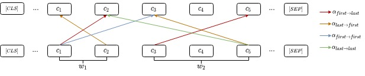

# Character-to-Character Attention


# Steps
* Prepare your data and replace the **demo.seg** file
* Run the script for pre-processing:
```
python process.sh
```
* Get the attention distribution for specific patterns:
```
python analysis.sh
```